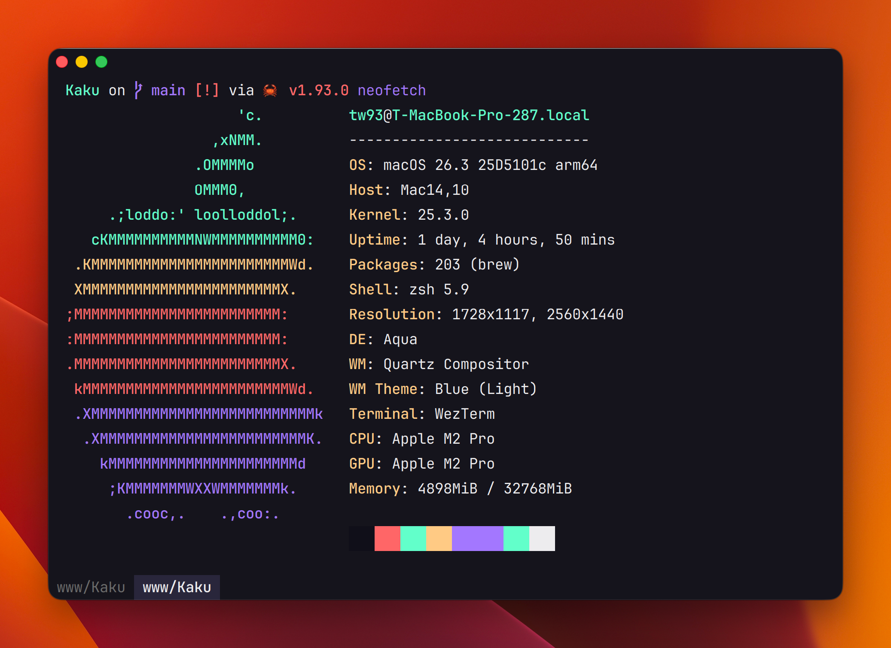

<div align="center">
  <h1>Kaku</h1>
  <p><em>A fast, out-of-the-box terminal built for AI coding.</em></p>
</div>

<p align="center">
  <a href="https://github.com/tw93/Kaku/stargazers"></a>
  <a href="https://github.com/tw93/Kaku/releases"></a>
  <a href="LICENSE.md"></a>
  <a href="https://github.com/tw93/Kaku/commits"></a>
  <a href="https://twitter.com/HiTw93"></a>
</p>

<p align="center">
  
  <br/>
  Kaku is a deeply customized fork of <a href="https://github.com/wez/wezterm">WezTerm</a>, designed for an <b>out-of-the-box</b> experience.
</p>

## Features

- **Zero Config**: Polished defaults with JetBrains Mono, **optimized macOS font rendering**, and smooth animations.
- **OpenCode Ready**: Detects OpenCode installation and offers an optimized high-contrast theme for AI coding.
- **Built-in Shell Suite**: Comes pre-loaded with Starship, z, syntax highlighting, and autosuggestions.
- **Fast & Lightweight**: Built on a stripped-down, GPU-accelerated core that launches instantly.
- **Lua Scripting**: Retains the full power of WezTerm's Lua engine for infinite customization.

## Quick Start

1. [**Download Kaku DMG**](https://github.com/tw93/Kaku/releases/latest) & Drag to Applications
2. Open Kaku - Right-click Open if blocked
3. Run `sudo xattr -d com.apple.quarantine /Applications/Kaku.app` if needed
4. On first launch, Kaku will automatically set up your shell environment

## Usage Guide

Kaku comes with intuitive macOS-native shortcuts:

| Action | Shortcut |
|--------|----------|
| **New Tab** | `Cmd + T` |
| **New Window** | `Cmd + N` |
| **Split Pane (Vertical)** | `Cmd + D` |
| **Split Pane (Horizontal)** | `Cmd + Shift + D` |
| **Zoom/Unzoom Pane** | `Cmd + Shift + Enter` |
| **Resize Pane** | `Cmd + Ctrl + Arrows` |
| **Close Tab/Pane** | `Cmd + W` |
| **Navigate Tabs** | `Cmd + [`, `Cmd + ]` or `Cmd + 1-9` |
| **Navigate Panes** | `Cmd + Opt + Arrows` |
| **Clear Screen** | `Cmd + R` |
| **Font Size** | `Cmd + +`, `Cmd + -`, `Cmd + 0` |
| **Smart Jump** | `z <dir>` |
| **Smart Select** | `zi <dir>` |
| **Go Back** | `z -` |

## Configuration

Kaku automatically configures **Starship**, **z**, **Autosuggestions**, **Syntax Highlighting**, and **OpenCode Theme**.

1. **Environment Variable**: `KAKU_CONFIG_FILE`
2. **Bundled Config**: `Kaku.app/Contents/Resources/kaku.lua`
3. **User Config**: `~/.config/kaku/kaku.lua`

## Development

```bash
# Clone the repository
git clone https://github.com/tw93/Kaku.git
cd Kaku

# Build and verify
cargo check
cargo test

# Build application and DMG
./scripts/build.sh
# Outputs: dist/Kaku.app and dist/Kaku.dmg
```

## Support

- If Kaku helped you, star the repo or [share it](https://twitter.com/intent/tweet?url=https://github.com/tw93/Kaku&text=Kaku%20-%20A%20fast,%20out-of-the-box%20terminal%20built%20for%20AI%20coding.) with friends.
- Got ideas or found bugs? Open an issue or PR.
- Like Kaku? <a href="https://miaoyan.app/cats.html?name=Kaku" target="_blank">Buy Tw93 a Coke</a> to support the project!

## License

MIT License, feel free to enjoy and participate in open source.
